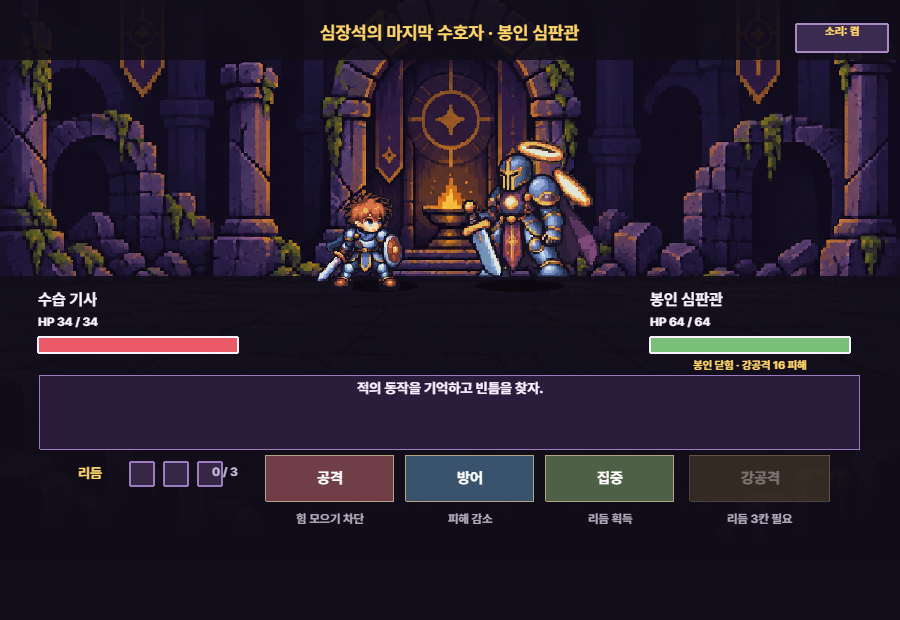
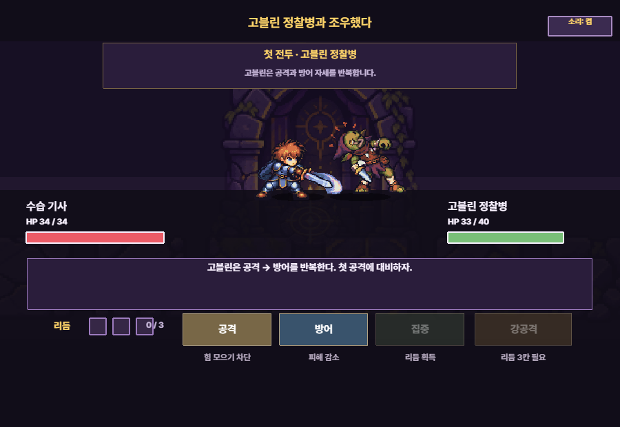
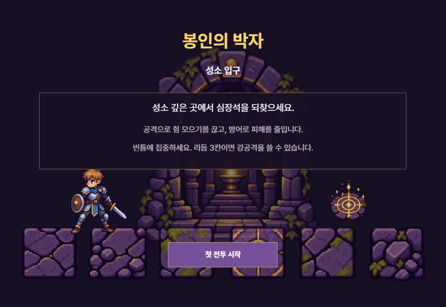
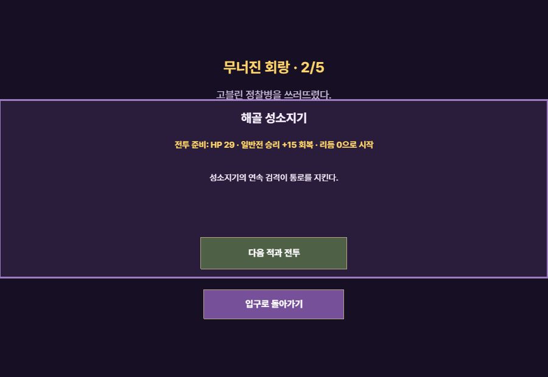
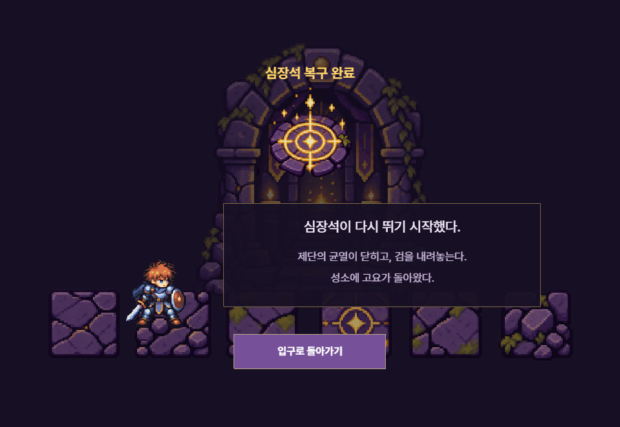

# 봉인의 박자

[English](#english)

적의 반복 동작을 기억하고 빈틈에 힘을 모으는 **중세 판타지 턴제 RPG**입니다. 고블린부터 봉인 심판관까지 다섯 전투를 플레이할 수 있습니다.



## 핵심 재미

적은 난수 대신 고정된 행동 습관을 반복하지만 다음 행동을 글자로 알려 주지 않습니다. 플레이어는 자세와 직전 결과를 관찰해 공격·방어·집중 중 하나를 고르고, 리듬 3을 모아 강공격으로 전환합니다.

- 공격은 기본 피해를 주고 적의 힘 모으기를 끊습니다.
- 방어는 공격 피해를 낮추며, 강공격을 정확히 막으면 리듬을 크게 얻습니다.
- 집중은 리듬을 쌓습니다. 적이 방어하는 틈에는 더 효과적이지만 공격 중에는 다운 위험이 있습니다.
- 충전 차단과 강공격 가드로 보스의 봉인을 노출한 뒤 강공격을 넣는 것이 최종 응용입니다.

## 실행 방법

필요한 것은 Python 3와 웹 브라우저뿐입니다. npm 설치나 빌드 과정은 없습니다. Phaser 3.90은 `index.html`에서 CDN으로 불러오므로 최초 실행 시 인터넷 연결이 필요합니다.

```powershell
git clone https://github.com/korearororo/rhythm-of-the-seal.git
cd rhythm-of-the-seal
python -m http.server 8000 --bind 127.0.0.1
```

브라우저에서 [http://127.0.0.1:8000/](http://127.0.0.1:8000/)을 열고 `첫 전투 시작`을 누릅니다. 서버는 터미널에서 `Ctrl+C`로 종료합니다.

## 조작

마우스나 터치로 화면 아래의 네 명령을 선택합니다.

| 명령 | 역할 |
| --- | --- |
| 공격 | 7 피해. 적의 힘 모으기를 차단하면 리듬 +2와 추가 이점을 얻습니다. |
| 방어 | 들어오는 피해를 줄입니다. 조건부 강공격을 막으면 리듬 +2를 얻습니다. |
| 집중 | 기본 리듬 +1, 적 방어 중에는 +2. 공격에 맞으면 다운됩니다. |
| 강공격 | 리듬 3을 모두 소비해 16 피해. 열린 보스 봉인에는 24 피해를 줍니다. |

연출 중에는 입력이 잠기며, HP·리듬·피해 팝업·자세·효과음·결과 로그가 한 행동의 결과를 함께 보여 줍니다.

## 5연속 전투

| 순서 | 적 | 배우는 판단 |
| ---: | --- | --- |
| 1 | 고블린 정찰병 | 공격과 방어의 두 박자, 방어 틈의 집중 |
| 2 | 해골 성소지기 | 두 번 이어지는 공격을 기억하는 법 |
| 3 | 코볼트 주술사 | 힘 모으기 차단과 적 리듬 |
| 4 | 오크 파수꾼 | 긴 패턴에서 조건부 강공격의 위치 예측 |
| 5 | 봉인 심판관 | 집중·차단·가드·봉인 노출·강공격의 종합 |

일반전 승리 뒤에는 HP를 15 회복하고 리듬을 0으로 초기화합니다. 보스 전에는 HP 34 완전 회복·리듬 0으로 시작하며, 패배하면 현재 전투만 다시 시작합니다.



## 구현 포인트

- 캐릭터 6종의 스프라이트는 프레임 좌표표를 기준으로 패킹하며, 공통 팔레트·픽셀 크기·발 기준선을 적용합니다. 긴 무기와 검격도 프레임 경계 안에 표시합니다.

- Phaser 3 + JavaScript로 만든 900×620 단일 페이지 웹 게임입니다.
- 적 프리셋은 HP·스프라이트·숨은 패턴을 데이터로 분리하며, 일반 적은 공격·방어·충전과 적 리듬 상태를 공유합니다.
- 리듬, 집중 피격 다운, 충전 차단, 다음 공격 칸 스킵, 조건부 강공격을 명시적 전투 상태로 처리합니다.
- 봉인 심판관은 묶음 시작의 HP와 플레이어 리듬으로 짧은 행동 묶음을 선택하고, 묶음 도중에는 다시 고르지 않습니다.
- 플레이어와 적의 전투 시트, 충돌 이펙트, 피해/리듬 팝업, Web Audio 효과음을 행동 해결 시점에 맞춰 재생합니다.

## 화면

| 입구 | 일반전 승리 후 전환 |
| --- | --- |
|  |  |

| 보스 | 엔딩 |
| --- | --- |
|  |  |

위 화면은 실제 게임 캔버스 캡처입니다. 보스와 엔딩 이미지는 장면 확인용 진입 경로로 촬영했습니다.

## 파일 구성

- `index.html`, `style.css`: 실행 페이지와 화면 스타일
- `game.js`: 장면 전환, 전투 규칙, 입력과 연출
- `sprite-art.js`: 스프라이트 패킹과 애니메이션 프레임 구성
- `assets/`: 게임이 로드하는 이미지와 프레임 좌표 데이터
- `docs/portfolio/`: 게임 소개 스크린샷

## 알려진 제한

- 첫 플레이 15~20분은 설계 목표이며, 다른 사람의 실제 플레이 시간으로 검증하지 않았습니다.

- 공개 배포 서비스와 공개 플레이 URL은 아직 선택하지 않았습니다.
- 진행 저장, 장비·인벤토리, 다수 적 전투는 현재 5전투 버전의 범위에 포함하지 않았습니다.
- Phaser를 CDN으로 불러오므로 완전한 오프라인 실행 패키지는 아직 제공하지 않습니다.

---

## English

# Rhythm of the Seal

A small, medieval fantasy turn-based RPG about remembering enemy patterns and finding the right moment to gather strength. Fight through five encounters, from a goblin scout to the Seal Arbiter.

### Gameplay

Enemies follow deterministic rules instead of choosing moves randomly. Their next action is hidden. Watch their movements and previous results, then choose between attacking, defending, focusing, and spending three Rhythm points on a heavy attack.

- Attack to deal damage and interrupt an enemy's charge.
- Defend to reduce damage. Blocking a heavy attack grants extra Rhythm.
- Focus to gain Rhythm, with a larger reward against a defending enemy. Getting hit while focusing knocks you down.
- Interrupt the boss's charge or block its heavy attack to expose the seal, then follow up with a heavy attack.

### Run locally

You need Python 3 and a web browser. No npm installation or build step is required. Phaser 3.90 loads from a CDN, so an internet connection is required when the library is not cached.

```sh
git clone https://github.com/korearororo/rhythm-of-the-seal.git
cd rhythm-of-the-seal
python -m http.server 8000 --bind 127.0.0.1
```

Open [http://127.0.0.1:8000/](http://127.0.0.1:8000/) and select **첫 전투 시작** (Start First Battle). Press `Ctrl+C` in the terminal to stop the server. The game's interface is currently in Korean.

### Controls

Click or tap one of the four commands at the bottom of the screen.

| Command | In-game label | Effect |
| --- | --- | --- |
| Attack | 공격 | Deals 7 damage. Interrupting a charge grants 2 Rhythm and disrupts the enemy's next attack. |
| Defend | 방어 | Reduces incoming damage. Blocking a heavy attack grants 2 Rhythm. |
| Focus | 집중 | Gains 1 Rhythm, or 2 against a defending enemy. Taking a hit causes knockdown. |
| Heavy Attack | 강공격 | Spends all 3 Rhythm to deal 16 damage, or 24 against the boss's exposed seal. |

Input is locked while an action resolves. Animations, HP bars, Rhythm, damage popups, sound effects, and the combat log show the result together. Defending reduces damage from both normal and heavy attacks.

### Five encounters

| Stage | Enemy | Key decision |
| ---: | --- | --- |
| 1 | Goblin Scout | Learn the attack–defend rhythm and focus during openings. |
| 2 | Skeleton Shrine Keeper | Remember consecutive attacks. |
| 3 | Kobold Shaman | Interrupt charges and manage enemy Rhythm. |
| 4 | Orc Sentinel | Anticipate conditional heavy attacks within a longer pattern. |
| 5 | Seal Arbiter | Combine focusing, interruption, defense, and seal exposure. |

Winning a regular encounter restores 15 HP and resets player Rhythm to zero. Before the boss, HP is fully restored to 34 and Rhythm is reset. Defeat restarts the current encounter.

### Implementation

- Phaser 3 and JavaScript, rendered on a 900×620 canvas.
- Six characters use coordinate-based sprite packing with a shared palette, pixel scale, and foot baseline. Long weapons and attack trails remain within their frame boundaries.
- Enemy presets separate health, graphics, and hidden patterns from action resolution.
- Explicit combat state handles Rhythm, knockdown, charge interruption, skipped attacks, and conditional heavy attacks.
- The boss chooses a short action sequence using health and player Rhythm at the start of that sequence.
- Character motion, impact effects, HP changes, popups, and Web Audio effects are synchronized with action resolution.

### Screenshots

The screenshots in the Korean section above are captured from the actual game canvas. Boss and ending screenshots use scene-preview entry points.

### Project structure

- `index.html`, `style.css`: launch page and page styling
- `game.js`: scenes, combat rules, input, and presentation
- `sprite-art.js`: sprite packing and animation frame configuration
- `assets/`: runtime images and frame-coordinate data
- `docs/portfolio/`: game screenshots

### Current limitations

- A 15–20 minute first playthrough is a design target, not a measured result from external playtesting.
- A public hosting service and playable URL have not been selected.
- Saving progress, equipment, inventory, and encounters with multiple enemies are outside the current five-encounter version.
- A fully offline package is not provided; Phaser currently loads from a CDN.
